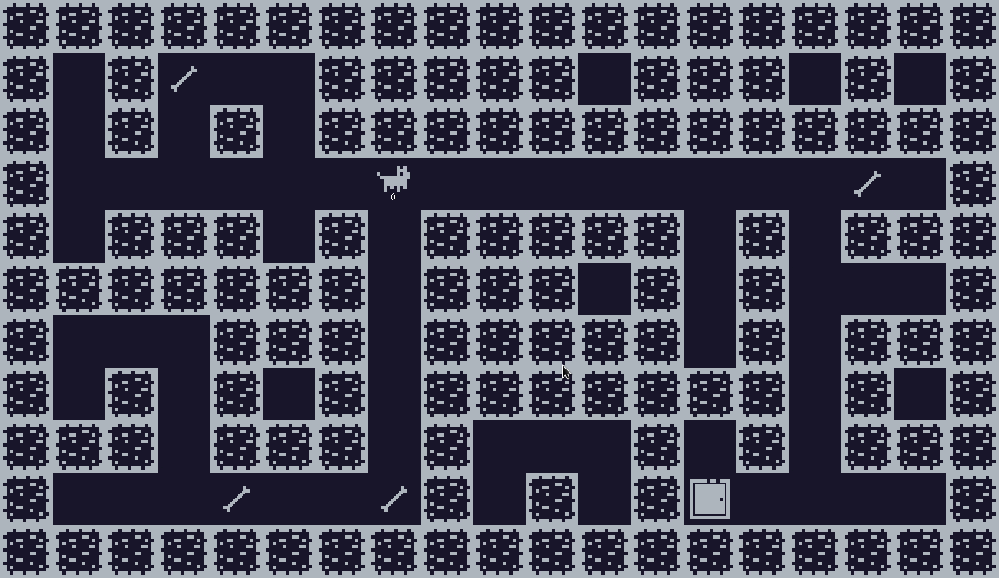

# [120/100] so_long
__This project is a small 2D game with minilibx. You'll learn about textures, sprites and tiles.__    


## 👀 Preview


## 🌟 Skills
> Graphics   
> Imperative programming

## ⬇️ Installing and running the project:
1. Clone && cd
```
git clone https://github.com/ramos21rodrigo/42porto.so-long.git && cd 42porto.so-long
```
2. Run `make`
```
make
```

3. Now you can play the game !

```
./so_long tests/map{x}.ber
```
>  Change (x) with any available map or add your own :) .

## ⚙️ Makefile Available Targets:
- `make` or `make all` - Makes _so-long_ and _mlx_

- `make clean` - Deletes all the resulting object files

- `make fclean` - Deletes _so-long_ and all the resulting object files

- `make re` - Deletes everything (object files and _so-long_) and rebuilds _so-long_

___
###### At  [42School](https://en.wikipedia.org/wiki/42_(school)), every project has specific rules or restrictions, and some of them must be written in accordance with the [Norm](https://github.com/42School/norminette). As a result, parts of the code could be more readable or explicit, and some used technologies could be different.
Made with tears 🥲
